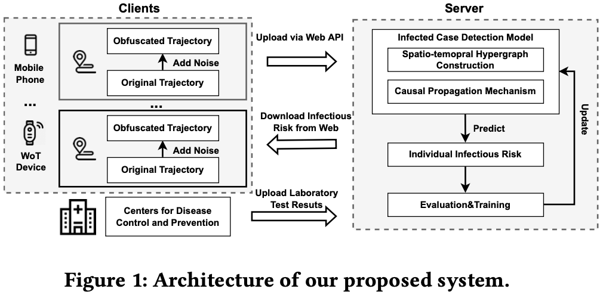

# Mobility Data Driven Privacy-preserving Model For COVID-19 Case Detection

This is the Pytorch implementation of the privacy-preserving model for COVID-19 case detection.



## Requirements

- torch>=1.7.0
- numpy>=1.23.4
- scikit-learn>=1.1.3
- tensorboard>=2.11.0
- tqdm>=4.64.1
- pyyaml=6.0
- scipy>=1.9.3

Dependency can be installed with the following command:


```bash
pip install -r requirements.txt
```

## Data Preparation
For the consideration of the user privacy, and avoid malicious usage of mobility data,the original mobility data is not publicly released. 
We will instead make the dataset available upon request to the corresponding author to researchers in the field for scientific purposes.

The preprocessed files (graph construction files, health status labels, etc.) for **SARS-CoV-2** dataset and **Omicron** dataset, are available at `dataset.tar.gz`, and should be decompressed and put into the folder `./dataset/` with the following command:

```bash
tar -xvzf dataset.tar.gz
```

## Model Training

Here are commands for training the model on both **SARS-CoV-2** dataset and **Omicron** dataset.


```bash
python train.py
```

To train on the different datset, 
please manually modify the _"dataset"_ item in the config file `.config/config.yaml`.

* ### SARS-CoV-2 Dataset

    ```yaml
        #Training
        model: HGNN_time
        dataset: primitive
        fts_type: time
        max_epoch: 1000
        n_hid: 672
        lr: 0.001
        milestones: [100, 200, 300]
        gamma: 0.7
        drop_out: 0.2
        print_freq: 10
        weight_decay: 0
        decay_step: 100
        decay_rate: 0.7
        early_stopping: 20
    ```

* ### Omicron Dataset

    ```yaml
        #Training
        model: HGNN_time
        dataset: omicron
        fts_type: time
        max_epoch: 1000
        n_hid: 672
        lr: 0.001
        milestones: [100, 200, 300]
        gamma: 0.7
        drop_out: 0.2
        print_freq: 10
        weight_decay: 0
        decay_step: 100
        decay_rate: 0.7
        early_stopping: 20
    ```
